# Database Design

```mermaid
erDiagram
    USERS {
        UUID id PK
        string email
        string password_hash
        string first_name
        string last_name
        UUID avatar_media_id FK
        string status
        timestamp created_at
        timestamp updated_at
    }

    ROLES {
        UUID id PK
        string code
        string name
    }

    USER_ROLES {
        UUID id PK
        UUID user_id FK
        UUID role_id FK
        timestamp assigned_at
    }

    CLUBS {
        UUID id PK
        string name
        text description
        string city
        string country
        UUID logo_media_id FK
    }

    CLUB_MEMBERS {
        UUID id PK
        UUID user_id FK
        UUID club_id FK
        string role
        timestamp joined_at
        timestamp left_at
    }

    ATHLETES {
        UUID id PK
        UUID user_id FK
        text biography
        date birth_date
        string gender
        string country
        UUID club_id FK
        timestamp created_at
        timestamp updated_at
    }

    COURSES {
        UUID id PK
        string title
        text description
        string status
        timestamp created_at
        timestamp updated_at
    }

    COURSE_MODULES {
        UUID id PK
        UUID course_id FK
        string title
        int order_index
    }

    LESSONS {
        UUID id PK
        UUID module_id FK
        string title
        text description
        text content
        int order_index
        timestamp created_at
    }

    MEDIA {
        UUID id PK
        string type
        string storage_key
        string filename
        string mime_type
        bigint size
        int duration
        string access_level
        timestamp created_at
        timestamp updated_at
    }

    LESSON_MEDIA {
        UUID id PK
        UUID lesson_id FK
        UUID media_id FK
        string relation_type
    }

    COURSE_PROGRESS {
        UUID id PK
        UUID user_id FK
        UUID course_id FK
        string status
        timestamp started_at
        timestamp completed_at
    }

    LESSON_PROGRESS {
        UUID id PK
        UUID user_id FK
        UUID lesson_id FK
        string status
        timestamp started_at
        timestamp completed_at
    }

    CERTIFICATES {
        UUID id PK
        UUID user_id FK
        UUID course_id FK
        UUID lesson_id FK
        string certificate_number
        timestamp issued_at
        string status
    }

    RULE_SETS {
        UUID id PK
        string name
        text description
        timestamp created_at
    }

    RULE_VERSIONS {
        UUID id PK
        UUID rule_set_id FK
        string version_label
        date effective_from
        date effective_to
        string status
        timestamp created_at
    }

    RULE_SECTIONS {
        UUID id PK
        UUID rule_version_id FK
        string title
        int order_index
    }

    RULES {
        UUID id PK
        UUID rule_section_id FK
        string code
        text text
        int order_index
    }

    PRODUCT_CATEGORIES {
        UUID id PK
        string name
        text description
    }

    MANUFACTURERS {
        UUID id PK
        string name
        string country
    }

    SELLERS {
        UUID id PK
        string name
        string contact_email
        string website
    }

    PRODUCTS {
        UUID id PK
        UUID product_category_id FK
        string name
        text description
        UUID manufacturer_id FK
        UUID seller_id FK
        timestamp created_at
    }

    PRODUCT_VARIANTS {
        UUID id PK
        UUID product_id FK
        string name
        string sku
        decimal price
        jsonb attributes
    }

    EQUIPMENT_REQUIREMENTS {
        UUID id PK
        UUID rule_id FK
        UUID product_id FK
        string requirement_type
        text description
    }

    TOURNAMENTS {
        UUID id PK
        string name
        text description
        UUID organizer_id FK
        UUID rule_version_id FK
        date start_date
        date end_date
        string status
    }

    TOURNAMENT_CATEGORIES {
        UUID id PK
        UUID tournament_id FK
        string name
        text description
    }

    TOURNAMENT_PARTICIPANTS {
        UUID id PK
        UUID athlete_id FK
        UUID tournament_id FK
        UUID category_id FK
        string status
        timestamp registered_at
    }

    TOURNAMENT_STAGES {
        UUID id PK
        UUID tournament_id FK
        string name
        int order_index
        string status
    }

    FIGHTS {
        UUID id PK
        UUID stage_id FK
        UUID participant_a_id FK
        UUID participant_b_id FK
        string status
        timestamp scheduled_at
        timestamp started_at
        timestamp ended_at
    }

    FIGHT_JUDGES {
        UUID id PK
        UUID fight_id FK
        UUID user_id FK
        string role
    }

    FIGHT_RESULTS {
        UUID id PK
        UUID fight_id FK
        UUID winner_id FK
        string result_type
        text reason
        text comment
        timestamp decided_at
    }

    ATHLETE_RATINGS {
        UUID id PK
        UUID athlete_id FK
        decimal rating_value
        timestamp updated_at
    }

    RATING_HISTORY {
        UUID id PK
        UUID athlete_id FK
        decimal rating_value
        string source_type
        UUID source_id
        timestamp recorded_at
    }

    ORDERS {
        UUID id PK
        UUID user_id FK
        UUID seller_id FK
        string status
        timestamp created_at
        timestamp updated_at
    }

    ORDER_ITEMS {
        UUID id PK
        UUID order_id FK
        UUID product_id FK
        UUID product_variant_id FK
        int quantity
        decimal unit_price
        decimal total_price
    }

    USERS ||--o{ USER_ROLES : has
    ROLES ||--o{ USER_ROLES : assigned_to

    USERS ||--o| ATHLETES : has_profile
    CLUBS ||--o{ CLUB_MEMBERS : includes
    USERS ||--o{ CLUB_MEMBERS : joins

    USERS ||--o{ COURSE_PROGRESS : tracks
    COURSES ||--o{ COURSE_PROGRESS : has

    USERS ||--o{ LESSON_PROGRESS : tracks
    LESSONS ||--o{ LESSON_PROGRESS : has

    USERS ||--o{ CERTIFICATES : receives
    COURSES ||--o{ CERTIFICATES : grants
    LESSONS ||--o{ CERTIFICATES : relates_to

    COURSES ||--o{ COURSE_MODULES : contains
    COURSE_MODULES ||--o{ LESSONS : contains
    LESSONS ||--o{ LESSON_MEDIA : linked_to
    MEDIA ||--o{ LESSON_MEDIA : used_by

    RULE_SETS ||--o{ RULE_VERSIONS : contains
    RULE_VERSIONS ||--o{ RULE_SECTIONS : contains
    RULE_SECTIONS ||--o{ RULES : contains

    TOURNAMENTS }o--|| RULE_VERSIONS : references
    TOURNAMENTS ||--o{ TOURNAMENT_CATEGORIES : has
    TOURNAMENTS ||--o{ TOURNAMENT_PARTICIPANTS : registers
    TOURNAMENTS ||--o{ TOURNAMENT_STAGES : has
    ATHLETES ||--o{ TOURNAMENT_PARTICIPANTS : participates_as
    TOURNAMENT_CATEGORIES ||--o{ TOURNAMENT_PARTICIPANTS : includes

    TOURNAMENT_STAGES ||--o{ FIGHTS : contains
    TOURNAMENT_PARTICIPANTS ||--o{ FIGHTS : participant_a
    TOURNAMENT_PARTICIPANTS ||--o{ FIGHTS : participant_b
    FIGHTS ||--o{ FIGHT_JUDGES : assigned
    USERS ||--o{ FIGHT_JUDGES : acts_as
    FIGHTS ||--|| FIGHT_RESULTS : produces
    TOURNAMENT_PARTICIPANTS ||--o{ FIGHT_RESULTS : winner

    ATHLETES ||--o{ ATHLETE_RATINGS : has
    ATHLETES ||--o{ RATING_HISTORY : has

    MANUFACTURERS ||--o{ PRODUCTS : makes
    SELLERS ||--o{ PRODUCTS : sells
    PRODUCT_CATEGORIES ||--o{ PRODUCTS : groups
    PRODUCTS ||--o{ PRODUCT_VARIANTS : has
    RULES ||--o{ EQUIPMENT_REQUIREMENTS : defines
    PRODUCTS ||--o{ EQUIPMENT_REQUIREMENTS : matches

    USERS ||--o{ ORDERS : places
    SELLERS ||--o{ ORDERS : receives
    ORDERS ||--o{ ORDER_ITEMS : contains
    PRODUCTS ||--o{ ORDER_ITEMS : purchased_as
    PRODUCT_VARIANTS ||--o{ ORDER_ITEMS : variant_selected
```

## Relationship notes

- User can have many roles through user_roles.
- A user may have one athlete profile, but tournament participation is tracked separately as a historical tournament registration.
- Club membership is historical and may span multiple clubs over time.
- Tournament references a specific RuleVersion, which must remain stable for historical record integrity.
- TournamentParticipant is distinct from Athlete and stores event-specific registration history.
- A fight references two tournament participants and may have multiple judges.
- Fight stores the final result; it does not model online scoring events.
- Ratings are derived from historical tournament outcomes and are kept separate from match results.
- Course, Module, and Lesson form the core educational structure.
- Media is a shared asset used by multiple domains.
- OrderItem stores the historical purchase price, preserving correct order history.
- Rules are versioned and historical versions remain intact.

---

# MVP Tables

## Phase 1

Authentication, users, roles, clubs, athletes.

- users
- roles
- user_roles
- clubs
- club_members
- athletes

## Phase 2

Education, media, rules.

- courses
- course_modules
- lessons
- lesson_media
- course_progress
- lesson_progress
- certificates
- media
- rule_sets
- rule_versions
- rule_sections
- rules

## Phase 3

Tournaments, participants, stages, fights, judges, results.

- tournaments
- tournament_categories
- tournament_participants
- tournament_stages
- fights
- fight_judges
- fight_results

## Phase 4

Equipment and orders.

- product_categories
- manufacturers
- sellers
- products
- product_variants
- equipment_requirements
- orders
- order_items

## Phase 5

Ratings and certificates.

- athlete_ratings
- rating_history
- certificates

Note: certificates are included in the education phase as a learning artifact, but they also belong to the later business recognition layer as the platform matures.
